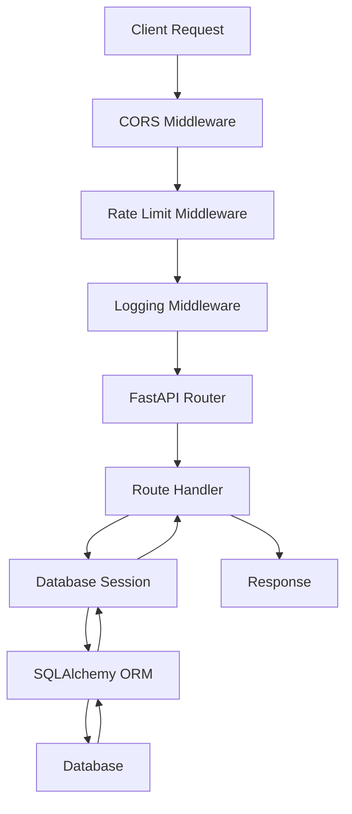
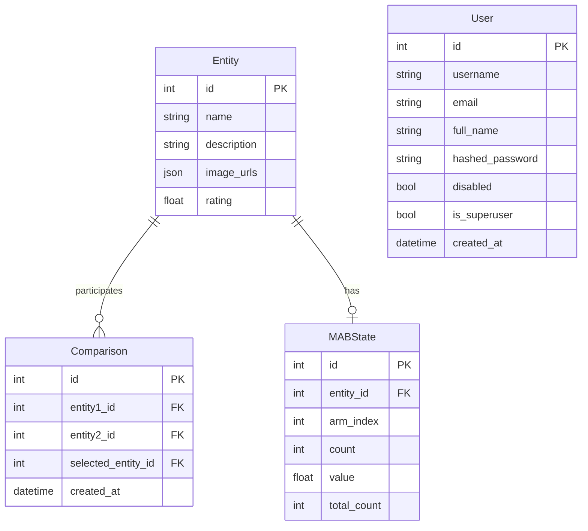

# Architecture

Understanding Compere's codebase structure.

## Project Structure

```
compere/
├── compere/                 # Backend package
│   ├── __init__.py          # Package metadata
│   ├── cli.py               # CLI entry point
│   ├── main.py              # FastAPI application
│   └── modules/             # Feature modules
│       ├── auth.py          # Authentication
│       ├── comparison.py    # Comparison management
│       ├── config.py        # Configuration
│       ├── database.py      # Database connection
│       ├── entity.py        # Entity CRUD
│       ├── errors.py        # Error handling
│       ├── mab.py           # MAB algorithm
│       ├── middleware.py    # Rate limiting, logging
│       ├── models.py        # SQLAlchemy & Pydantic models
│       ├── rating.py        # Elo calculations
│       └── similarity.py    # Entity similarity
├── compere-ui/              # Vue.js frontend
├── tests/                   # Test suite
├── docs/                    # Internal documentation
├── documentation/           # User-facing MkDocs
├── Dockerfile               # Backend container
├── docker-compose.yml       # Multi-service config
└── pyproject.toml           # Package configuration
```

## Backend Architecture

### Module Responsibilities

| Module | Responsibility |
|--------|----------------|
| `main.py` | FastAPI app, middleware setup, health endpoints |
| `config.py` | Environment validation, configuration access |
| `database.py` | SQLAlchemy engine, session management |
| `models.py` | ORM models (Entity, Comparison, MABState, User) |
| `entity.py` | Entity CRUD operations |
| `comparison.py` | Comparison creation and retrieval |
| `rating.py` | Elo rating calculations |
| `mab.py` | UCB algorithm, pair selection |
| `similarity.py` | Entity similarity matching |
| `auth.py` | JWT authentication, user management |
| `middleware.py` | Rate limiting, request logging |
| `errors.py` | Centralized error handling |

### Request Flow



### Database Models



## Configuration System

Configuration flows through `config.py`:

```python
# Centralized config access
from compere.modules.config import (
    get_config,
    get_database_url,
    get_elo_k_factor,
    is_auth_enabled,
)

# Used throughout the codebase
config = get_config()
k_factor = get_elo_k_factor()
```

Benefits:

- Single source of truth
- Validation on startup
- Type-safe accessors
- Environment-specific behavior

## Error Handling

Centralized in `errors.py`:

```python
from compere.modules.errors import (
    handle_database_error,
    handle_not_found,
    handle_validation_error,
)

# Usage
try:
    db_entity = db.query(Entity).filter(Entity.id == entity_id).first()
    if db_entity is None:
        handle_not_found("Entity", entity_id)
except SQLAlchemyError as e:
    handle_database_error(e, "get entity")
```

Features:

- Environment-aware error messages
- Consistent error format
- Proper logging

## Frontend Architecture

The Vue.js frontend (`compere-ui/`):

```
compere-ui/
├── src/
│   ├── components/      # Reusable UI components
│   ├── views/           # Page components
│   ├── stores/          # Pinia state management
│   ├── services/        # API client
│   └── utils/           # Utility functions
├── package.json         # Dependencies
└── vite.config.js       # Build configuration
```

### State Management

Using Pinia stores:

- `entities` - Entity list and CRUD
- `comparisons` - Comparison history
- `auth` - Authentication state

### API Integration

Centralized in `services/api.js`:

```javascript
import axios from 'axios'

const api = axios.create({
  baseURL: import.meta.env.VITE_API_BASE_URL
})

export const getEntities = () => api.get('/entities/')
export const createEntity = (data) => api.post('/entities/', data)
// ...
```

## Algorithm Integration

### Comparison Flow

1. **UCB Selection** (`mab.py`): Select optimal pair
2. **User Decision**: User chooses winner
3. **Rating Update** (`rating.py`): Update Elo ratings
4. **MAB Update** (`mab.py`): Update UCB statistics

### Code Example

```python
# In comparison.py
def create_comparison(comparison: ComparisonCreate, db: Session):
    # Create comparison record
    db_comparison = Comparison(**comparison.model_dump())
    db.add(db_comparison)

    # Get entities
    entity1 = db.query(Entity).get(comparison.entity1_id)
    entity2 = db.query(Entity).get(comparison.entity2_id)

    # Update Elo ratings
    update_elo_ratings(db, entity1, entity2, comparison.selected_entity_id)

    db.commit()
    return db_comparison
```

## Extensibility

### Adding New Endpoints

1. Create a new module in `compere/modules/`
2. Define router with FastAPI
3. Include router in `main.py`

### Adding New Models

1. Define SQLAlchemy model in `models.py`
2. Define Pydantic schemas
3. Import in `main.py` to register with Base
